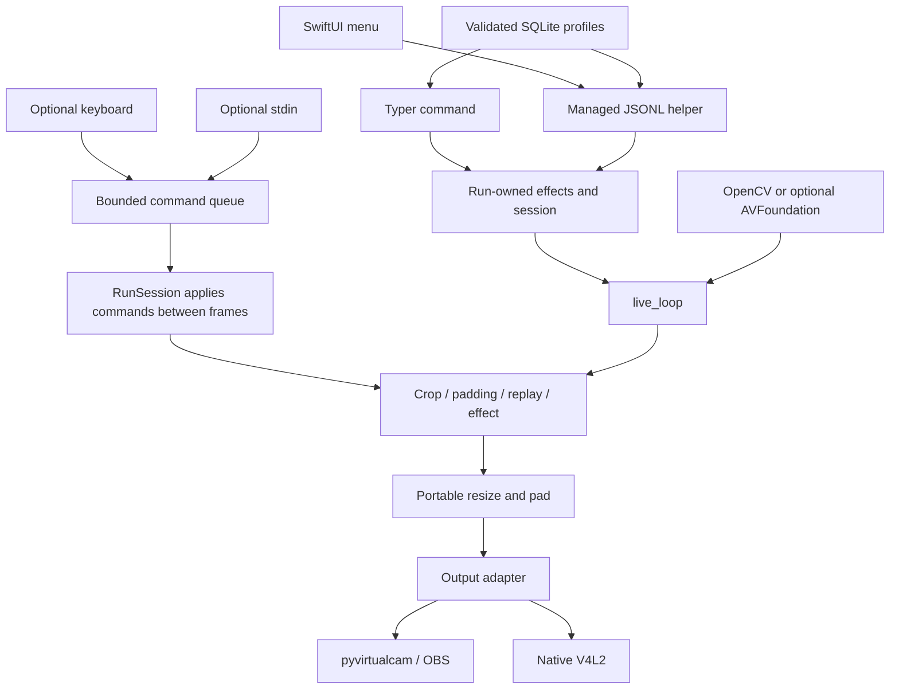

# Current architecture

Webcam Mods processes uint8 BGR frames in Python. Entrypoints are the Typer CLI
`webcam_mods`, `python -m webcam_mods`, and the local JSONL helper
`python -m webcam_mods.control`. An optional SwiftUI MenuBarExtra app owns the
helper process and controls one session. No network listener is opened.

## Run and frame flow

`entry.py` creates fresh run state and effects. `RunSession` owns crop/padding
settings, queued commands and bounded recording/replay. Keyboard and stdin adapters
start explicitly and submit immutable commands. The calling frame thread drains
commands between frames, then crops, pads, records/replays and invokes the chosen
effect. `live_loop` resizes/pads and sends to the output, which paces delivery. Camera and screen commands select virtual-cam or preview with
--output. Preview receives the same final array and ends the loop through the
output should_stop hook when its window closes.

`track-face` instead owns its detector, previous prediction and crop tracker, and
disables crop/replay controls. Optional segmentation follows face cropping and resize to fixed output dimensions. Face
misses retain the last prediction. Segmentation mirrors once; ordinary crop and
brightness do not. Each CLI run closes its owned models and native contexts.
Legacy Python face/segmentation helper functions retain lazy compatibility
instances; new runs should instantiate the classes directly.

Screen sharing uses typed MSS region capture through the same session, controls,
output sizing and adapter cleanup. MSS supplies contiguous uint8 BGR frames and
requested dimensions/FPS. GUI output and test PNG adapters remain available.

`cli.py` shares Typer's option definitions with each command. Root settings
resolution is deferred until command parsing completes; explicit command-side
options override root values without command defaults erasing explicit root values.
Root help lists frequent grouped options; command help exposes all common options.

## Module map

| Source | Responsibility |
| --- | --- |
| `__main__.py`, `entry.py` | CLI selection, per-run effects, common options and cleanup |
| `cli.py` | Shared option parsing, placement precedence and complete command help |
| `session.py` | Validated frame preparation, ordered command application, recording ownership |
| `loopback.py` | Adapter selection, metadata validation, synchronous/repeated delivery, cooperative stop and error behavior |
| `frame_producer.py` | Worker-owned capture/effects, latest snapshot, bounded shutdown |
| `effects.py` | Shared owned tracking/background/brightness composition |
| `profiles.py` | Validated launch profiles and transactional SQLite persistence |
| `control.py` | One-session lifecycle controller and local JSONL request/event protocol |
| `macos/MenuBar/WebcamMods.swift` | Native menu, managed helper transport and settings UI |
| `mediapipe_delegate.py` | Isolated CPU/Metal probes and persistent identity-scoped cache |
| `input/input.py` | Adapter protocol and partial-setup context cleanup |
| `input/video_dev.py` | OpenCV capture, configured FPS and retry logic |
| `input/screen.py` | Typed MSS screen-region capture and complete adapter metadata |
| `macos/capture.py` | Optional AVFoundation callback capture and newest-frame mailbox |
| `macos/vision.py` | Optional instance-owned Vision person masks |
| `macos/core_image.py` | Optional Core Image background compositing/Gaussian blur |
| `output/pyvirtcam.py` | OBS virtual camera and idempotent cleanup |
| `output/v4l2loopback.py` | Native Linux output and consumer monitoring |
| `output/gui.py` | Bare final-frame preview, paced events and close/Escape shutdown |
| `mods/video_mods.py` | Portable geometry, resize and HSV brightness |
| `mods/mp_face.py` | Lazy instance-owned MediaPipe face detector with automatic CPU/Metal selection |
| `mods/person_segmentation.py` | Instance-owned MediaPipe/Vision effects and float32 blending |
| `mods/camera_motion.py` | Instance-owned crop interpolation |
| `mods/record_replay.py` | Bounded recorder and looping replay |
| `uses/interactive_controls.py` | Lazy optional keyboard/control adapters |
| `utils/cli_input.py` | Explicit stoppable stdin reader |
| `utils/config.py` | Validated JSON settings and atomic persistence |
| `config.py` | Bundled assets and compatibility setting access |
| `settings.py` | Validated immutable startup snapshot; CLI > env > defaults |
| `timing.py` | Monotonic frame pacing and responsive output event polling |
| `models.py` | Checksum-verified model cache/download |

`output/file.py` remains empty. Legacy helpers are compatibility/demo entrypoints;
supported CLI tracking uses run-owned effect classes.

## Lifecycle and errors

The loop acquires input once, validates finite positive negotiated metadata, then
selects default output if none was supplied. Negotiated dimensions may differ from
requested dimensions. CLI frame preparation retains valid crops or resets invalid
crops when actual input dimensions change. Adapter setup sits inside cleanup scope;
context entry attempts teardown even when setup partially fails. Input and controls
are stopped in `finally`; output context teardown closes output.

Effect exceptions and `None` results produce an error image or, with
`freeze_on_error`, the last successful resized frame. The initial frozen frame is
no-signal. Output/capture exceptions propagate. Empty input retries at output cadence and pumps output events;
bounded runs or strict errors raise. `max_frames`, `strict_errors`, `before_frame`, `should_stop` and `on_ready` are
Python testing/control seams, not common CLI options. The local controller uses
cooperative stop and first-successful-frame readiness.

On-demand mode retains Linux consumer detection. Paused capture is closed and the
loop sends a no-signal frame on a 0.5-second cadence. pyvirtualcam always reports in use.
The loop owns pacing across all outputs; adapter compatibility waits are not called.
Preview polls events with sleep slices of at most 20 ms during waits. Event cost
counts toward each deadline, without a redundant poll once the deadline is reached.
Small timing overruns preserve schedule phase; whole-period misses restart cadence
without catch-up bursts.

## State and threads

| State | Owner |
| --- | --- |
| Startup settings | Immutable snapshot resolved before opening resources |
| Crop/padding | RunSession Config |
| Commands | Bounded session queue; immutable command objects |
| Pressed keys | Per-run keyboard adapter |
| Recording/replay | Per-run Recorder; default 256 MiB maximum |
| Model handles/timestamps | Per-run effect instances, closed by CLI |
| Crop interpolation | Per-run CropTracker |
| Last face prediction | Owned tracking detector |
| Native capture mailbox/timestamps | AVFoundationCamera instance |

Native macOS input candidates exclude OBS output by manufacturer/model before
applying VIDEO_IN or --input-device. Default 0 selects the first remaining input;
this avoids feedback and dependence on OBS enumeration position.

CLI imports create no keyboard listener, config writes or stdin thread. Keyboard
callbacks enqueue controls; persistence and mutations happen on the processing
thread. Stdin uses a stoppable polling reader without closing caller-owned stdin.
AVFoundation capture adds a worker and serial callback queue, publishing an owned
BGR copy in a one-frame mailbox. Core Image uses per-frame autorelease pools.

The command interface distinguishes acceptance (`submit`) from application
(`apply_commands`, returning results). Whole-session local control is handled separately by `Controller`: validated
profile configuration, one background run, cooperative stop and explicit status
events. It refuses concurrent starts and prevents restart after an unsafe worker
timeout. `RunSession` remains the frame-level crop/replay control seam. In repeat mode, cleanup
ownership transfers to the processing worker so shutdown timeouts cannot close
effects still in use. See [frame delivery](frame-delivery.md) for cancellation
and shutdown limits.

## Dependencies and frame representation

Python 3.14 only, tracked uv.lock, setuptools, explicit OpenCV-contrib/NumPy,
MediaPipe Tasks 1.0.1 (patched Metal-enabled source snapshot with automatic delegate selection on macOS ARM64), and
pyvirtualcam remain portable defaults. Linux-only dependencies stay in the `linux` extra. PyObjC frameworks are lazy imports in the
optional `macos` extra. All supported effects/output still exchange BGR arrays;
native backends do not yet eliminate CPU/native conversion boundaries.

Models honor XDG_CACHE_HOME, otherwise ~/.cache/webcam-mods/models. Downloads use
temporary files, SHA-256 verification and atomic replacement; cached files are
reverified. See [current state](current-state.md), [native backend evidence](macos-backends.md)
and [remaining improvement plan](improvement-plan.md).

## Local control and profiles

The native app communicates over its helper's stdin/stdout using JSON lines.
Requests carry an ID; responses carry that ID and a result or error. The bounded
strict JSON reader rejects oversized lines, duplicate keys and non-finite numbers,
and recovers at the next newline. Status events
are asynchronous. Python logging stays on stderr. No socket, port, remote auth or
interactive CLI scraping is involved. See [protocol](macos-menu.md).

Profiles are validated before persistence and again before a session starts.
Optional stable camera IDs and output overrides extend existing JSON settings
without changing the SQLite schema. Native capture resolves identity before
acquisition; missing/excluded devices fail before effects open. Legacy index-only
profiles retain their existing behavior.
SQLite uses parameterized statements and transactions. Schema version 1 is
initialized locally; unknown schema versions are rejected. No migration chain
exists yet. Introducing one requires append-only migration checks and normal
setup hook installation under project instructions.

Effect construction and cleanup are shared across CLI/profile sessions. Tracking,
background and brightness run in that order. Tracking outputs fixed dimensions
before segmentation, preventing per-zoom model reconstruction/calibration.
The controller's state distinguishes starting, running, stopping, idle and error;
running means the first processed frame has been delivered, rather than merely
accepting Start. Explicit Stop interrupts capture waits and completes cleanup
before another Start can acquire resources.

## Recovery and terminal state

Damaged profile rows produce sanitized diagnostics through `profiles.errors`;
`profiles.list` continues returning valid profiles. CLI listing reports diagnostics
on stderr. Exports publish complete validated JSON atomically, with exclusive
creation unless overwrite is explicit.

Shutdown timeouts atomically mark the controller terminal with `restart_required`.
Late worker completion cannot report idle or remove that error. A new helper
process is required before another run. Native inventory replies carry request
generations and backend association; stale replies cannot enable Start. UI edits
remain drafts until Save, with a modified marker on the selected profile.
