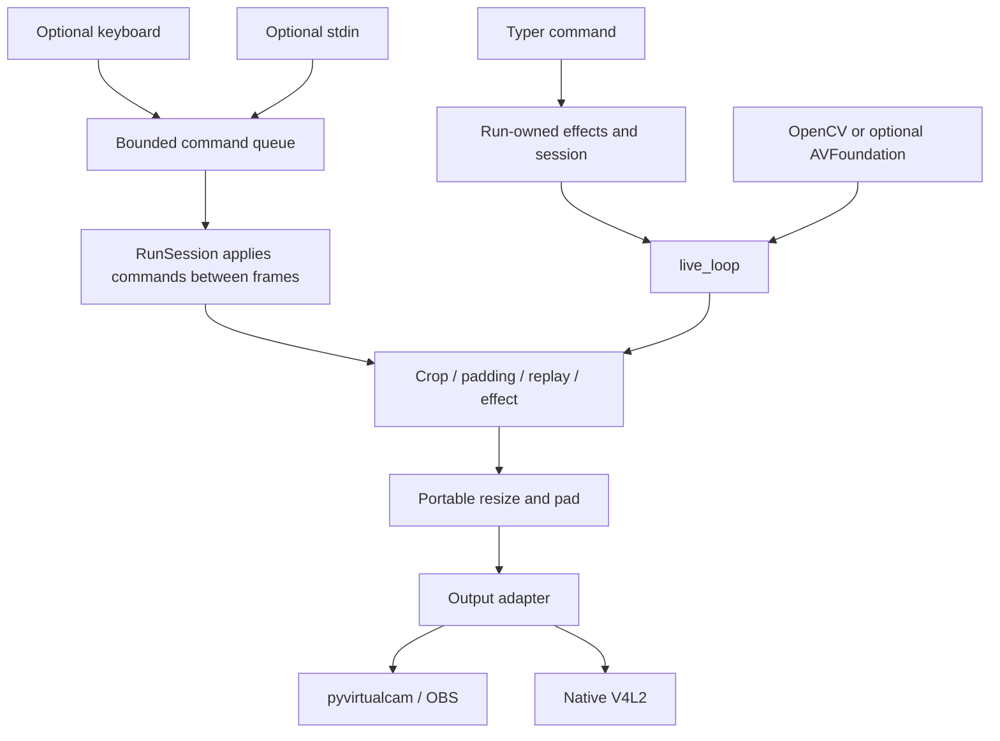

# Current architecture

Webcam Mods is a synchronous Python BGR frame-processing application. Supported
entrypoints are the Typer CLI `webcam_mods` and `python -m webcam_mods`. No HTTP
server, daemon or cross-process runtime control API exists.

## Run and frame flow

`entry.py` creates fresh run state and effects. `RunSession` owns crop/padding
settings, queued commands and bounded recording/replay. Keyboard and stdin adapters
start explicitly and submit immutable commands. The calling frame thread drains
commands between frames, then crops, pads, records/replays and invokes the chosen
effect. `live_loop` resizes/pads and sends to the output, which paces delivery. Camera commands select virtual-cam or preview with
--output. Preview receives the same final array and ends the loop through the
output should_stop hook when its window closes.

`track-face` instead owns its detector, previous prediction and crop tracker, and
disables crop/replay controls. Optional segmentation follows face cropping. Face
misses retain the last prediction. Segmentation mirrors once; ordinary crop and
brightness do not. Each CLI run closes its owned models and native contexts.
Legacy Python face/segmentation helper functions retain lazy compatibility
instances; new runs should instantiate the classes directly.

Screen sharing retains its existing MSS implementation and is outside the native
backend work. GUI output and test PNG adapters remain available as existing seams.

## Module map

| Source | Responsibility |
| --- | --- |
| `__main__.py`, `entry.py` | CLI selection, per-run effects, common options and cleanup |
| `session.py` | Validated frame preparation, ordered command application, recording ownership |
| `loopback.py` | Adapter selection, metadata validation, synchronous loop and error behavior |
| `input/input.py` | Adapter protocol and partial-setup context cleanup |
| `input/video_dev.py` | OpenCV capture, configured FPS and retry logic |
| `input/screen.py` | Existing MSS screen-region capture |
| `macos/capture.py` | Optional AVFoundation callback capture and newest-frame mailbox |
| `macos/vision.py` | Optional instance-owned Vision person masks |
| `macos/core_image.py` | Optional Core Image background compositing/Gaussian blur |
| `output/pyvirtcam.py` | OBS virtual camera and idempotent cleanup |
| `output/v4l2loopback.py` | Native Linux output and consumer monitoring |
| `output/gui.py` | Bare final-frame preview, paced events and close/Escape shutdown |
| `mods/video_mods.py` | Portable geometry, resize and HSV brightness |
| `mods/mp_face.py` | Lazy instance-owned CPU MediaPipe face detector |
| `mods/person_segmentation.py` | Instance-owned MediaPipe/Vision effects and float32 blending |
| `mods/camera_motion.py` | Instance-owned crop interpolation |
| `mods/record_replay.py` | Bounded recorder and looping replay |
| `uses/interactive_controls.py` | Lazy optional keyboard/control adapters |
| `utils/cli_input.py` | Explicit stoppable stdin reader |
| `utils/config.py` | Validated JSON settings and atomic persistence |
| `config.py` | Bundled assets and compatibility setting access |
| `settings.py` | Validated immutable startup snapshot; CLI > env > defaults |
| `timing.py` | Monotonic frame pacing and responsive output event polling |
| `models.py` | Checksum-verified model cache/download |

`output/file.py` remains empty. Legacy `uses/track_face.py` references a missing
module; `uses/track_box.py` retains its outdated demo call. Neither is supported
CLI face tracking.

## Lifecycle and errors

The loop acquires input once, validates finite positive negotiated metadata, then
selects default output if none was supplied. Negotiated dimensions may differ from
requested dimensions. CLI frame preparation retains valid crops or resets invalid
crops when actual input dimensions change. Adapter setup sits inside cleanup scope;
context entry attempts teardown even when setup partially fails. Input and controls
are stopped in `finally`; output context teardown closes output.

Effect exceptions and `None` results produce an error image or, with
`freeze_on_error`, the last successful resized frame. The initial frozen frame is
no-signal. Output/capture exceptions propagate. Empty input retries at output cadence and pumps output events;
bounded runs or strict errors raise. `max_frames`, `strict_errors` and
`before_frame` are Python testing/control seams, not CLI options.

On-demand mode retains Linux consumer detection. Paused capture is closed and the
loop sends a no-signal frame on a 0.5-second cadence. pyvirtualcam always reports in use.
The loop owns pacing across all outputs; adapter compatibility waits are not called.
Preview pumps events at most 20 ms apart during waits. Slow processing skips catch-up bursts.

## State and threads

| State | Owner |
| --- | --- |
| Startup settings | Immutable snapshot resolved before opening resources |
| Crop/padding | RunSession Config |
| Commands | Bounded session queue; immutable command objects |
| Pressed keys | Per-run keyboard adapter |
| Recording/replay | Per-run Recorder; default 256 MiB maximum |
| Model handles/timestamps | Per-run effect instances, closed by CLI |
| Crop interpolation | Per-run CropTracker |
| Last face prediction | Per-command closure |
| Native capture mailbox/timestamps | AVFoundationCamera instance |

CLI imports create no keyboard listener, config writes or stdin thread. Keyboard
callbacks enqueue controls; persistence and mutations happen on the processing
thread. Stdin uses a stoppable polling reader without closing caller-owned stdin.
AVFoundation capture adds a worker and serial callback queue, publishing an owned
BGR copy in a one-frame mailbox. Core Image uses per-frame autorelease pools.

The command interface distinguishes acceptance (`submit`) from application
(`apply_commands`, returning results). There is no external status service or
finished cross-process session API. Per-run effects remain owned by the CLI run
scope rather than by a generic plugin/session framework.

## Dependencies and frame representation

Python 3.13/3.14, tracked uv.lock, setuptools, explicit OpenCV-contrib/NumPy,
MediaPipe Tasks 0.10.35 CPU, and pyvirtualcam remain portable defaults. Linux-only
dependencies stay in the `linux` extra. PyObjC frameworks are lazy imports in the
optional `macos` extra. All supported effects/output still exchange BGR arrays;
native backends do not yet eliminate CPU/native conversion boundaries.

Models honor XDG_CACHE_HOME, otherwise ~/.cache/webcam-mods/models. Downloads use
temporary files, SHA-256 verification and atomic replacement; cached files are
reverified. See [current state](current-state.md), [native backend evidence](macos-backends.md)
and [remaining improvement plan](improvement-plan.md).
