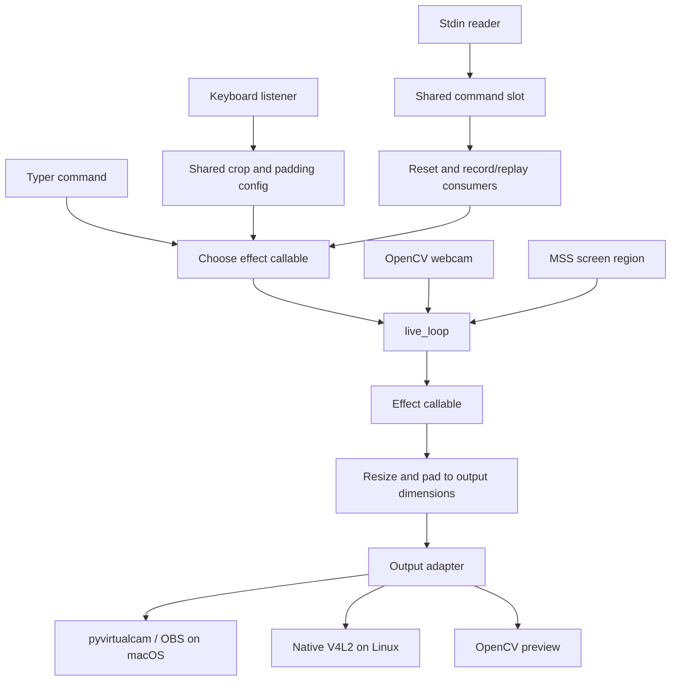

# Current architecture

## Scope and terminology

Webcam Mods is a synchronous Python frame-processing application. Its supported
entrypoint is the Typer CLI, `webcam_mods`, also available through
`python -m webcam_mods`. It has no HTTP server or supported runtime control API.

An **input adapter** acquires frames. An **effect** transforms a frame. An
**output adapter** delivers frames and may pace delivery. A **run** is one
invocation of `live_loop`; it is not yet an explicit session object. A **control**
changes crop/padding state or record/replay state. A **seam** is an interface where
adapters or effects can be substituted, as the headless tests already do.

## Module map

| Source | Responsibility |
| --- | --- |
| `src/webcam_mods/__main__.py` | Exposes the Typer application from `entry.py` |
| `src/webcam_mods/entry.py` | Commands, effect composition, common CLI options |
| `src/webcam_mods/loopback.py` | Default output selection and synchronous frame loop |
| `src/webcam_mods/input/input.py` | Shared input/output classes and context-manager behavior |
| `src/webcam_mods/input/video_dev.py` | OpenCV webcam capture and retry logic |
| `src/webcam_mods/input/screen.py` | MSS screen-region capture |
| `src/webcam_mods/output/pyvirtcam.py` | pyvirtualcam output, used by default outside Linux |
| `src/webcam_mods/output/v4l2loopback.py` | Native Linux device output and consumer monitoring |
| `src/webcam_mods/output/gui.py` | OpenCV window preview |
| `src/webcam_mods/mods/video_mods.py` | Crop, padding, resize, and brightness operations |
| `src/webcam_mods/mods/mp_face.py` | Lazy CPU MediaPipe face detection |
| `src/webcam_mods/mods/person_segmentation.py` | Lazy CPU MediaPipe segmentation and background effects |
| `src/webcam_mods/mods/camera_motion.py` | Face crop interpolation and padding |
| `src/webcam_mods/mods/record_replay.py` | In-memory recording and replay |
| `src/webcam_mods/uses/interactive_controls.py` | Global keyboard listener, crop/padding controls |
| `src/webcam_mods/utils/cli_input.py` | Daemon stdin reader and shared command slot |
| `src/webcam_mods/config.py` | Environment-derived constants and bundled image paths |
| `src/webcam_mods/utils/config.py` | JSON crop/padding persistence |
| `src/webcam_mods/models.py` | Checksum-verified model download and local cache |

`output/file.py` is empty. Saved-frame output exists in the test harness, not as
a user-facing CLI output. `uses/track_face.py` references a missing legacy module;
`uses/track_box.py` is a developer demo with an outdated `generate_crop` call.
Neither is the supported face-tracking command.

## Frame and control flow

`live_loop` accepts an optional effect callable, input/output adapters, and a
listener. Effects receive OpenCV-style BGR frames; returning `None` invokes the
configured error behavior. Existing tests substitute PNG input/output adapters
and pass `interactive_listener=None` to avoid desktop controls.

Most commands compose the following processing order:

1. Crop using persisted crop dimensions and position.
2. Pad inward using persisted padding settings.
3. Record or replay the cropped/padded frame.
4. Consume the interactive reset command.
5. Apply the command-specific effect.
6. Resize/pad to output dimensions in `live_loop`, then send.

`track-face` uses its own detection/crop callable and disables the loop's keyboard
listener. It retains the last detected face when detection misses. Its optional
background blur runs after face cropping. Segmentation effects mirror the image
horizontally; ordinary crop and brightness effects do not.

## Lifecycle and error behavior

When no input is supplied, the loop creates a webcam. When no output is supplied,
it opens the input temporarily to inspect dimensions and FPS, rejects dimensions
different from configured input dimensions, closes that input, and selects output.
Linux selects `V4l2Cam`; other systems select `PyVirtualCam`.

The main run starts the listener, sets up capture again, enters the output context,
and reads/processes/sends frames serially. `finally` tears down input and stops the
listener; the output context tears down output after successful entry. Resources
acquired inside a failing output `setup` are not guaranteed cleanup by this
context-manager arrangement. The initial probe occurs before the main `try`.

An effect exception or `None` result normally produces the error image, or the
last successful frame with `freeze_on_error=True`. Until a successful frame exists,
the frozen frame is the no-signal image. An empty input normally retries immediately.
Bounded runs or strict error mode raise on empty input; strict mode also propagates
effect failures. Output send failures propagate. `max_frames` and `strict_errors`
support deterministic testing; they are not CLI options.

With on-demand mode, the loop asks output whether it is in use. When paused, it
tears down capture and sends a no-signal frame after a 0.5-second sleep. Native
Linux output uses inotify open/close events to estimate consumers. pyvirtualcam
reports always in use. This is consumer detection, not portable pause support.

## State and threading

There is no centralized runtime state owner:

| State | Current owner |
| --- | --- |
| Environment settings | Module constants evaluated at import |
| Crop/padding settings | Global `Config` instance in interactive controls |
| Pressed keys | Global set modified by pynput callbacks |
| Stdin command | Single global mutable slot, `inp[0]` |
| Recorded frames and replay index | Globals in `record_replay.py` |
| Face/segmentation model and timestamp | Globals in their effect modules |
| Smoothed crop and transition | Globals in `camera_motion.py` |
| Last face prediction | Local closure in CLI `track_face` |

Frame processing runs on the calling thread. A pynput listener thread updates
crop/padding state and persists it. A daemon thread reads stdin. These control paths
share mutable state without a command queue or frame-consistent settings snapshot.
The stdin slot can overwrite commands; multiple consumers clear the same slot.

Importing `entry.py` imports interactive controls and record/replay. This constructs
a keyboard listener, creates/loads persisted configuration, and starts the stdin
thread before command execution. Disabling pan/padding flags does not avoid that
listener construction. Face/segmentation models, unlike controls, initialize lazily.
Their native handles remain global and are not explicitly closed by loop shutdown.

## Models and dependencies

The project uses Python 3.13 or 3.14, a tracked `uv.lock`, setuptools packaging,
NumPy/OpenCV processing, and MediaPipe Tasks pinned to 0.10.35. Both models use the
CPU delegate. `models.py` honors `XDG_CACHE_HOME`, otherwise uses `~/.cache`, and
stores models under `webcam-mods/models`. Downloads use a temporary file, verify
SHA-256, and atomically replace the cache file. Cached files are reverified on lookup.

Linux-specific `v4l2` and `inotify-simple` dependencies are in the `linux` extra;
their imports are confined to the native output path and file monitor. OpenCV is
imported directly throughout the project but currently supplied transitively by
dependencies rather than explicitly listed in `pyproject.toml`.

For verification and limitations, see [current state](current-state.md). For the
proposed session/control architecture, see [improvement plan](improvement-plan.md).
