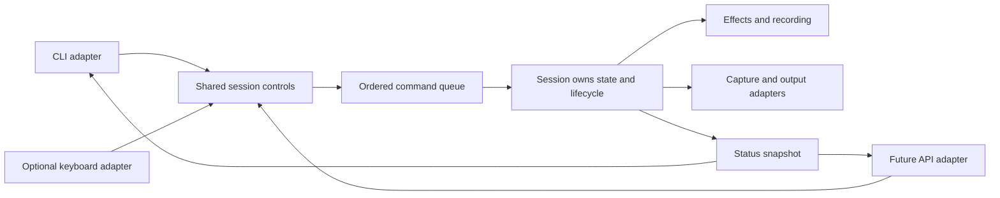

# Improvement plan

Status: proposed, not implemented. Goal: retain macOS and Linux behavior while
making startup, configuration, lifecycle, and controls predictable and testable.
CLI comes first, but application control should be reusable by API callers.

## Findings and priorities

| Priority | Finding and evidence | Proposed change | Acceptance evidence |
| --- | --- | --- | --- |
| 1 | Only CodeQL runs in CI; existing effect tests are local | Run checks and headless tests on macOS ARM64 and Linux x86_64, covering supported Python 3.13/3.14 environments | Passing matrix, installation checks, CLI startup checks, retained visual fixtures |
| 2 | `entry.py` imports listener construction, config I/O, and stdin-thread startup | Deepen controls module: explicit startup/stop, disabled adapter, session-owned state and queued commands | CLI help works without desktop hooks or config writes; disabled controls never initialize pynput |
| 3 | `live_loop` probes/reopens capture, screen metadata differs, output setup can partially leak resources | Deepen runtime module: acquire input once, validate negotiated metadata, own cleanup across partial startup | Fake adapters prove startup failure cleanup, screen metadata compatibility, and repeated runs |
| 4 | Settings split across globals/JSON/options; `IN_FPS`, output device, and common error flag are inconsistently honored | Deepen settings module: resolve and validate values once; propagate consistently | CLI/env/persistence precedence tests; malformed settings rejected; actual FPS/device behavior verified |
| 5 | OS dispatch is embedded in loop; native Linux output lacks pacing; on-demand behavior differs | Keep output adapter seam; make selection and capability handling explicit, centralize cadence ownership | Backend selection tests, fake-clock pacing tests, Linux consumer tests, hardware smoke checks |
| 6 | Models, motion and replay use globals; models lack explicit close; replay can fail empty and grow without bound | Deepen session effect modules: own model/motion/replay state, reset on new runs, bound recording | Empty/new replay tests, repeated-run isolation, model cleanup, recording limit enforcement |
| 7 | Loose frame/metadata types, stale mypy configuration, transitive OpenCV dependency, legacy demos | Type changed interfaces, declare intended dependencies, remove or repair legacy entrypoints in separate changes | Scoped static checks and install/import smoke tests on both platforms |

These changes increase locality: failures and state concentrate in their owning
module. They increase leverage: CLI, keyboard, tests, and eventual API callers
exercise the same application behavior. Avoid creating a generic plugin framework
or splitting every helper into another shallow module.

## Proposed control architecture

Current controls manipulate globals directly. CLI flags configure startup only;
stdin and keyboard paths have separate mutations. API control should not repeat
those mutations or reach into effect internals.

Proposed shape, with concrete public interfaces deferred to implementation:

One session should own validated settings, effects, input/output lifecycle,
record/replay state, and current status. CLI and keyboard adapters submit control
commands to the same application module. A later API adapter uses that same seam.
Two existing control sources justify this seam before an HTTP transport exists.

Apply runtime mutations on the processing thread between frames, using an ordered
queue, so a frame sees a coherent state snapshot. Report whether a command was
accepted, applied, or rejected; do not treat enqueue success as completed work.
Keep status reads separate from state mutations. Shutdown should stop accepting
commands, release adapters and model handles, and report completion.

Candidate control operations include crop/padding/reset, effect settings,
record/stop/replay, status, and run shutdown. These are planning categories, not
existing endpoints or finalized method names. Device, format, or resolution changes
may require restart; distinguish those from settings safe to apply between frames.
Hot input switching remains separate scope.

## CLI first, API next

1. Establish both-platform CI and headless CLI startup coverage.
2. Remove import-time side effects. Add explicit control enable/disable behavior
   and consistently propagate existing common options.
3. Introduce session-owned settings/state and shared commands; route CLI startup,
   keyboard, and stdin through that behavior. Preserve existing command names,
   environment names, and config compatibility where practical.
4. Tighten lifecycle, metadata, pacing, and capability handling. Extend existing
   adapter tests rather than replacing the real-effect pipeline suite.
5. Add API transport once shared controls are covered through their interface.
   Do not force API users through a spawned interactive CLI or global stdin slot.

A one-shot CLI cannot mutate another process without communication. If controlling
an already-running session becomes CLI scope, that requires an explicit IPC or API
connection. Startup options and in-process controls alone do not provide it.

Before implementing an API server, decide local-only versus remote access,
authentication, single versus multiple sessions, transport, supported operations,
and status/error contract. These are open product decisions. No port, HTTP routes,
authentication scheme, daemon, or framework is selected by this proposal.

## Portability requirements

- Share effect processing and application controls across macOS and Linux.
- Keep OBS/pyvirtualcam and native V4L2 delivery as output adapters. Do not replace
  Linux output with pyvirtualcam before proving device selection, pacing, pixel
  conversion, and consumer-detection parity.
- Lazy-load desktop and Linux dependencies only when their adapters are selected.
  Report missing dependencies and permissions clearly.
- Validate output capabilities before enabling on-demand behavior. Unsupported
  behavior needs an explicit policy rather than assuming every adapter supports it.
- Request configured capture properties, inspect negotiated properties, and choose
  deliberate fallback/error behavior. Do not assume cameras honor setters.
- Give frame cadence one owner, with monotonic timing and tests, to avoid adapter
  differences or double sleeping. Measure live FPS before claiming improvement.
- Respect platform config/cache paths in a future migration while preserving or
  importing existing `~/.webcam-mods.conf`; use atomic, validated persistence.
- Keep kernel module setup outside normal application startup.

## Verification strategy

Retain current headless tests as processing regressions. Add command-level coverage
for option propagation and startup without desktop controls; adapter-level coverage
for selection, capabilities, partial failures, and negotiated metadata; and
session-level coverage for ordered commands, reset/replay, and shutdown.

Use real CPU model tests on supported macOS and Linux environments. Separately
document hardware smoke checks for macOS OBS delivery and Linux v4l2loopback
delivery/on-demand behavior. CI without physical devices must not claim those
checks passed. Keep visual artifacts when diagnosing output quality.

Top implementation recommendation: CI guardrails followed by optional, explicit
controls. This enables reliable CLI work and establishes the shared control seam
needed for APIs without committing prematurely to a server design.
